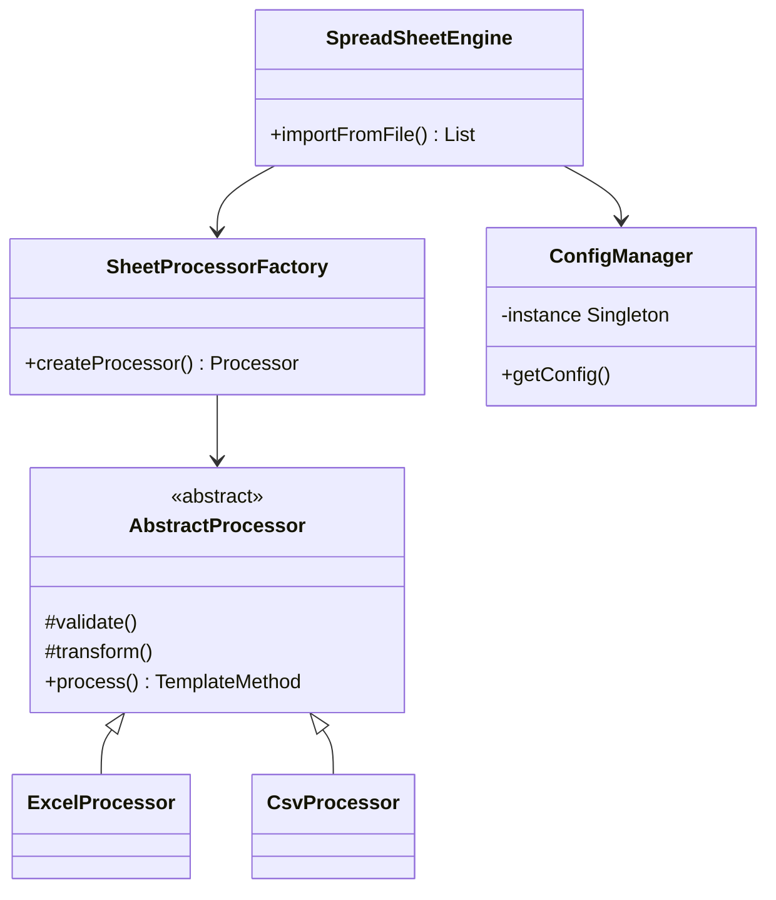

# 📊 SpreadSheet-Importer

**Motor de importação de planilhas inteligente** que transforma dados de Excel/CSV em objetos Java seguindo padrões de projeto robustos.


## 🌟 Funcionalidades

- **Mapeamento declarativo** de colunas para atributos de objetos
- Suporte a múltiplos formatos:
  - Excel (`.xlsx`, `.xls`) via Apache POI
  - CSV (`.csv`) via OpenCSV
- **Padrões de projeto** bem definidos:
  - `Factory` para criação de processadores
  - `Template Method` para fluxo de importação
  - `Singleton` para gerenciamento de configurações
  - `Strategy` para algoritmos de validação
- Validação de dados com mensagens customizadas

## 🛠 Como Usar

### 1. Adicione a dependência

```xml
<dependency>
    <groupId>io.github.seuusuario</groupId>
    <artifactId>spreadsheet-importer</artifactId>
    <version>1.0.0</version>
</dependency>
```

### 2. Defina seu modelo

```java
@SheetModel
public class Produto {
    @Column(name = "Código", index = 0)
    private String codigo;
    
    @Column(name = "Nome", index = 1)
    private String nome;
    
    // Getters e Setters
}
```

### 3. Importe os dados

```java
SpreadSheetEngine engine = new SpreadSheetEngine();
List<Produto> produtos = engine.importFromFile("planilha.xlsx", Produto.class);

produtos.forEach(System.out::println);
```

## 🏗 Arquitetura



## 🚀 Padrões Implementados

| Padrão          | Aplicação                          | Benefício                           |
|-----------------|------------------------------------|-------------------------------------|
| **Factory**     | `SheetProcessorFactory`            | Flexibilidade para novos formatos   |
| **Template**    | `AbstractProcessor`                | Reuso de fluxo de processamento     |
| **Singleton**   | `ImportConfigManager`              | Acesso global às configurações      |
| **Strategy**    | `ValidationStrategy`               | Validações intercambiáveis          |

## 📚 Documentação Técnica

### Estrutura de Pacotes

```
src/
├── main/
│   ├── java/
│   │   └── io/
│   │       └── github/
│   │           └── seusuario/
│   │               └── spreadsheetimporter/
│   │                   ├── core/          # Lógica principal
│   │                   ├── factory/       # Implementações Factory
│   │                   ├── model/         # Anotações e DTOs
│   │                   ├── strategy/      # Algoritmos de validação
│   │                   └── util/          # Utilitários
│   └── resources/      # Templates e configurações
```

## 📦 Dependências

- Apache POI 5.2.3 (Excel)
- OpenCSV 5.7.1 (CSV)
- Lombok 1.18.24 (OPCIONAL)

## 🤝 Como Contribuir

1. Faça um fork do projeto
2. Crie sua branch (`git checkout -b feature/nova-funcionalidade`)
3. Commit suas mudanças (`git commit -m 'Adiciona nova funcionalidade'`)
4. Push para a branch (`git push origin feature/nova-funcionalidade`)
5. Abra um Pull Request

## 📝 Licença

MIT License - Consulte o arquivo [LICENSE](LICENSE) para detalhes.

---

Desenvolvido com ❤️ por Fernando Afonso - [🔗 LinkedIn](https://www.linkedin.com/in/fernando-afonso-de-souza-dias-6b3206171/)